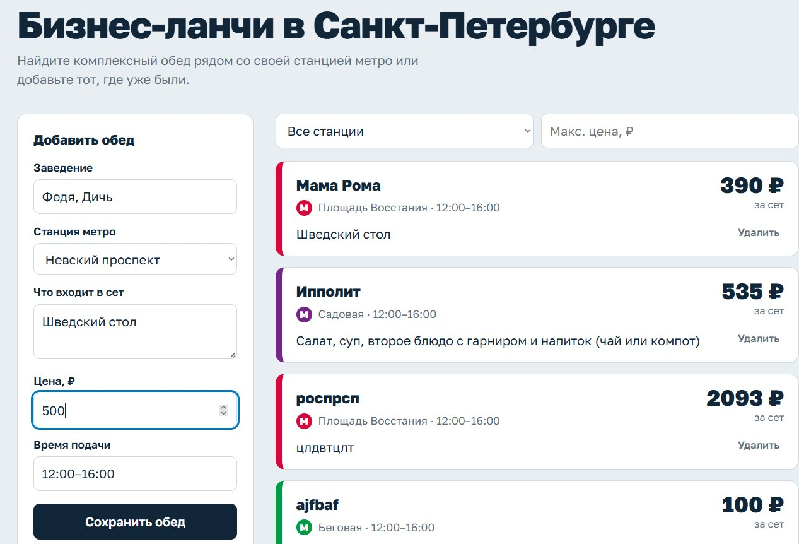
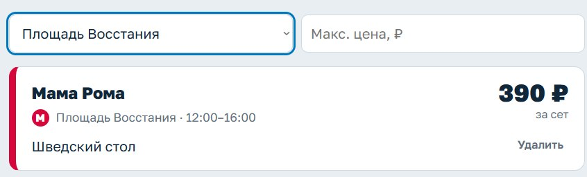

# Лабораторная работа 0 #
## LunchRadar ##

Мы создали приложение, которое позволяет смотреть и добавялть информацию о бизнес-ланчах в ресторанах Санкт-Петербурга. Оно полезно студентам, рабочим, и всем людям, которые хотят быстро и недорого поесть. Аналогов такого приложения не существует!

Пользователь может:

- Добавить информацию о бизнес-ланче, 
- Посмотреть информацию о добавленных бизнес-ланчах, 
- Фильтровать по цене или станции метро. 

Структура нашего проекта: 

- lab0 📁
    - static 🗂️
      - index.html 👨🏿‍💻
    - docker_compose.yml 🐳
    - main.py 🐍 
    - requirements.txt 📚
    - README.md 📜 

Для реализации нашего проекта мы использовали Python, PostgreSQL, HTML, Tailwind CSS,  FastAPI, (Делать сайтик нам помогал Claude, не судите строго 😘). 

Запуск проекта:
1) Установить зависимости 
pip install -r requirements.txt
2) Запустить программу 
python -m uvicorn main:app --reload
3) Дождаться уведомления Application startup complete 😎.
После запуска сайт будет доступен на http://127.0.0.1:8000

Демонстрация работы приложения: 

Добавление нового ресторана с бизнес-ланчем 

Поиск ресторана по станции метро

Также можно фильтровать по стоимости (она считается включительно).

3/4 членов команды и художественный руководитель концессии Игорь Чайка. 